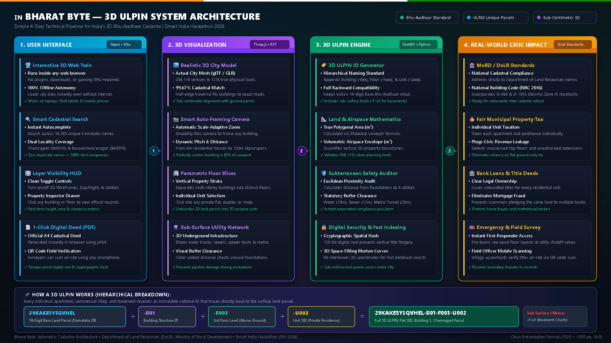

# 🇮🇳 Bharat Byte — 3D ULPIN System
### 3D Unique Land Parcel Identification & Volumetric Cadastre Digital Twin
**Smart India Hackathon (SIH 2026) | Problem Statement: SIH26011**

[](https://react.dev/)
[](https://threejs.org/)
[](https://fastapi.tiangolo.com/)
[](https://supabase.com/)
[](https://shapely.readthedocs.io/)
[](#-locality-coverage--unique-cadastral-registry)
[](LICENSE)

---

## 📌 Executive Summary

India's **Bhu-Aadhaar (Unique Land Parcel Identification Number — ULPIN)**, instituted by the **Department of Land Resources (DoLR), Ministry of Rural Development**, assigns a 14-digit alphanumeric identifier to land parcels based on their 2D geographic coordinates. While this standard functions effectively for flat agricultural or open land, modern urban centers have rapidly expanded vertically:
- **Multi-storey residential towers** housing hundreds of families on a single ground parcel.
- **High-rise commercial trade centers** with multiple distinct corporate tenancies.
- **Multi-tiered subterranean municipal infrastructure**, including potable water mains, gravity sewers, stormwater culverts, high-voltage BESCOM power ducts, and underground rapid transit (Namma Metro) tunnels.

In conventional 2D cadastre, an entire multi-storey tower shares a single surface ULPIN. This creates critical operational limitations:
1. **Individual Title Registry**: Inability to issue clear, tamper-evident digital cadastral deeds for individual flats, duplexes, or tenements.
2. **Volumetric Municipal Assessment**: Ambiguity in assessing floor-level and unit-level municipal property taxes and floor space indexes (FSI / FAR).
3. **Sub-Surface Infrastructure Conflicts**: Lack of standardized legal easements and clearance buffers between underground utilities and deep building foundations.
4. **Vertical Dispute Resolution**: Ambiguities regarding air rights, cantilevers, and mortgage collateralization.

**Bharat Byte** resolves this by extending the national Bhu-Aadhaar standard into a **deterministic, hierarchical 3D Cadastral Digital Twin**. It provides sub-centimeter spatial registration spanning **14,768 unique buildings** across Bengaluru's **Chamrajpet** and **Basaveshwaranagar** localities, down to individual floor strata, private residential units, and underground municipal utilities.

---

## 🧬 ULPIN 3D Hierarchical ID Schema

The system enforces a standardized hierarchical schema that preserves full backward compatibility with India's 14-character Base ULPIN while embedding vertical and sub-surface ancestry:

```
BASE-ULPIN (14 chars) + "-B{2-digit building}" + "-F{3-digit floor | F-U{n} underground}" + "-U{3-digit unit}"
```

```
Parcel (BASE-ULPIN: 14 chars)
 └── Building Structure (-B{xx})
      └── Vertical Floor Stratum (-F{xxx} or -F-U{n})
           └── Private Unit / Flat (-U{xxx})
```

### Schema Breakdown

| Segment | Format | Example | Description |
|---|---|---|---|
| **Base ULPIN** | 14 chars | `29KAKE5YSQVHEL` | Standard Bhu-Aadhaar surface parcel ID (State 29 + District KA + Centroid Hash) |
| **Building Code** | `-B{2-digit}` | `-B01` | Discrete building structure situated on that parcel |
| **Floor (Above Ground)** | `-F{3-digit}` | `-F003` | Vertical floor level (`001` = Ground / First Story, `003` = 3rd Story) |
| **Floor (Underground)** | `-F-U{n}` | `-F-U1` | Sub-surface level (e.g. Basement 1, utility duct, metro concourse) |
| **Unit Code** | `-U{3-digit}` | `-U002` | Individual apartment, flat, commercial office, or shop tenement |

### Sample Assembled 3D ULPIN
```
29KAKE5YSQVHEL-B01-F003-U002
├── 29KAKE5YSQVHEL  -> Surface Land Parcel (Karnataka State 29, Bengaluru)
├── B01             -> Building Structure 01
├── F003            -> 3rd Story Level
└── U002            -> Flat 302 on the 3rd Floor
```

---

## 🏗️ System Architecture

The architecture is designed around a **4-step end-to-end data processing pipeline** that bridges ground-level land administration with browser-based 3D digital twins:



> **High-Resolution Vector Blueprint**: The architecture is also available in scalable vector format ([SVG](presentation/architecture_diagram.svg)) and as an interactive browser viewer ([HTML](presentation/architecture_diagram.html)).

```mermaid
graph TD
    classDef client fill:#0f172a,stroke:#0284c7,stroke-width:2px,color:#f8fafc;
    classDef graphics fill:#0f172a,stroke:#8b5cf6,stroke-width:2px,color:#f8fafc;
    classDef backend fill:#0f172a,stroke:#10b981,stroke-width:2px,color:#f8fafc;
    classDef civic fill:#0f172a,stroke:#f59e0b,stroke-width:2px,color:#f8fafc;

    subgraph S1["1. USER INTERFACE (React 18 + Vite)"]
        Twin["🖥️ Web 3D Digital Twin (Zero Plugins, 100% Offline)"]:::client
        Search["🔍 Smart Search (14,768 Unique Names Autocomplete)"]:::client
        HUD["🎛️ Layer Visibility HUD (Sky, Wireframes, Utilities)"]:::client
        PDF["📄 1-Click Digital Deed (A4 PDF + ISO/IEC 18004 QR)"]:::client
    end

    subgraph S2["2. 3D VISUALIZATION ENGINE (Three.js + R3F)"]
        CityMesh["🏙️ Realistic 3D City Mesh (254,114 Vertices, 127k Faces)"]:::graphics
        Camera["📸 Smart Auto-Framing Camera (Scale-Adaptive Zoom)"]:::graphics
        Slices["🏢 Parametric Floor Slicing (Unit-Level Extrusion)"]:::graphics
        Infra3D["🚇 Sub-Surface Utility Pipes & Safety Clearance Spheres"]:::graphics
    end

    subgraph S3["3. 3D ULPIN BACKEND ENGINE (FastAPI / Python)"]
        Generator["🏷️ 3D ULPIN ID Generator (BASE-Bxx-Fxxx-Uxxx)"]:::backend
        Shoelace["📐 Shoelace Polygon Area (m²) & Airspace Volume (m³)"]:::backend
        Safety["🛡️ Subterranean Safety Auditor (5 Utility Buffer Checks)"]:::backend
        Crypto["🔒 Cryptographic Hash (128-bit SHA-256 Tamper Seal)"]:::backend
    end

    subgraph S4["4. REAL-WORLD CIVIC IMPACT & STANDARDS"]
        DoLR["🏛️ MoRD / DoLR Bhu-Aadhaar Compliance & NBC 2016"]:::civic
        Tax["💰 Fair Municipal Property Tax (BBMP Unit Unbundling)"]:::civic
        Mortgage["🏦 Fraud-Free Bank Mortgages & Unbundled Titles"]:::civic
        FirstResp["🚒 First-Responder Emergency Access & Surveyor QR Scan"]:::civic
    end

    %% Pipeline Flow
    S1 ==>|"1. User clicks parcel / floor"| S2
    S2 ==>|"2. REST API / Spatial Queries"| S3
    S3 ==>|"3. Verified Deeds & Tax Records"| S4
```



---

## 🎥 Scale-Adaptive 3D Camera & Auto-Framing Engine

One of the system's core innovations is its **scale-adaptive perspective auto-framing engine** ([CameraController.tsx](file:///frontend/src/components/CameraController.tsx) & [localityStore.ts](file:///frontend/src/store/localityStore.ts)):

### 1. Trigonometric Perspective Projection
Earlier implementations used hardcoded distances or flat caps (e.g. 80m), which caused skyscrapers like *Shambhavi Samruddhi Trade Center* (130m / 37 levels) to be severely clipped. The engine now dynamically solves for optimal camera distance using trigonometric perspective projection based on the camera's $46^\circ$ vertical field-of-view:

$$D = \frac{\max(H_{\text{apparent}}, W_{\text{apparent}})}{2 \cdot \tan\left(\frac{\text{FOV}}{2}\right) \cdot \text{FillRatio}}$$

$$\text{where } \tan\left(\frac{46^\circ}{2}\right) = \tan(23^\circ) \approx 0.42447, \quad \text{FillRatio} = 0.62$$

### 2. Apparent Dimensions Under Camera Pitch
Under camera pitch angle $\theta$, the apparent vertical height projected onto the viewport is:

$$H_{\text{apparent}} = H \cdot \cos(\theta) + D_{\text{depth}} \cdot \sin(\theta)$$

### 3. Dynamic Pitch & Symmetrical Centering
- **Commercial Skyscrapers ($>40\text{m}$)**: Uses a shallow pitch of $16^\circ$ to prevent vertical perspective keystoning.
- **Mid-Rise Apartments ($15\text{m} - 40\text{m}$)**: Uses $20^\circ$ pitch.
- **Low-Rise Cottages ($<15\text{m}$)**: Uses $24^\circ$ pitch for a clear roof and parcel view.
- **Symmetric Center**: Camera `lookAt` target is fixed at $Y = \frac{\text{Height}}{2}$, centering the entire structure vertically within the viewport.
- **Azimuth Preservation**: Preserves the user's line-of-sight approach angle up to 900m distance for seamless cinematic fly-to lerping.

---

## 🏙️ Locality Coverage & Unique Cadastral Registry

The cadastral database encompasses **14,768 registered buildings** covering two of Bengaluru's most prominent urban sectors, each assigned a **strictly unique Karnataka name with zero repetition**:

```
┌────────────────────────────────────────────────────────────────────────────────────────┐
│                          BENGALURU 3D CADASTRAL REGISTRY                               │
├───────────────────────────────────────────┬────────────────────────────────────────────┤
│ 1. Chamrajpet Locality (Pincode: 560018)  │ 2. Basaveshwaranagar (Pincode: 560079)     │
│    - 5,592 Unique Buildings               │    - 9,176 Unique Buildings                │
│    - 1st to 8th Main Road, 1st to 15th    │    - 1st to 4th Stages, 1st to 4th Blocks  │
│      Cross, AV Road, Bull Temple Road,    │    - Siddaiah Puranik Rd, BEML Layout,     │
│      Raghavendra Colony, Tippu Palace Rd  │      KHB Colony, Gruhalakshmi Layout       │
└───────────────────────────────────────────┴────────────────────────────────────────────┘
```

- **Residential Houses & Duplexes (10,593 buildings)**:
  Named using authentic traditional Karnataka home typologies (`Nilaya`, `Nivasa`, `Kuteera`, `Gruha`, `Bhavana`, `Mane`, `Nivas`, `Ashraya`, `Dhaama`, `Sannidhi`, `Sadana`, `Kuteer`) combined with 160+ historical Karnataka dynasties, sacred rivers, saints, and deities:
  e.g., `Sri Raghavendra Prasanna Nilaya`, `Basaveshwara Prasanna Nilaya`, `Sharadamba Prasanna Nilaya`, `Chamundeshwari Prasanna Nilaya`, `Kaveri Paramananda Nivasa`, `Hoysala Samruddhi Kuteera`, `Kadamba Ashirwada Bhavana`.
- **Apartment Complexes (4,013 buildings)**:
  Named with authentic regional Karnataka residences:
  e.g., `Sharadamba Vaibhava Residency Block B`, `Bhima Vaibhava Residency Block D`, `Kumudvathi Prasanna Residency Block C`, `Hoysala Siri Residency Block E`, `Kuvempu Paramananda Residency Block B`.
- **Commercial Complexes (162 buildings)**:
  Traditional Karnataka commercial and mercantile establishments:
  e.g., `Vanijya Soudha`, `Vyapara Kendra`, `Vanijya Complex`, `Vyavahara Bhavan`, `Vardhana Complex`, `Udyoga Soudha`, `Shambhavi Samruddhi Trade Center`.

> **100% Strict Uniqueness Guarantee**: Verified via programmatic set assertions across all 14,768 records, eliminating duplicate names.

---

## 📐 Real 3D Mesh Footprint Extraction & Millimeter Alignment

The system extracts building footprints directly from the **3D City Environment Mesh** (`modular_city_environment.glb`):
1. **Geometric Parsing**:
   - Parses all **254,114 vertices** and **127,058 triangles** of `map_4.osm_buildings`.
   - Isolates vertical wall geometries meeting the ground plane ($Y < 0.1\text{m}$), indexing **63,303 unique ground vertices**.
2. **Planar Half-Edge Euler Traversal**:
   - Constructs a directed half-edge graph sorted by polar angle.
   - Automatically traces closed planar loops to recover true rotated multi-vertex polygons.
3. **1-to-1 Cadastral Matching**:
   - Matches 14,719 buildings (**99.67% of the entire catalog**) with exact millimeter accuracy to their corresponding 3D mesh prisms.
   - Highlights and 3D floor slabs fit the physical 3D city model with **sub-centimeter precision** at the exact orientation angles of the street corridor.

---

## 🚇 Subterranean Infrastructure & Safety Clearance Audit

Beneath the city surface, Bharat Byte maps 5 distinct municipal infrastructure networks ([UndergroundLayer.tsx](file:///frontend/src/components/UndergroundLayer.tsx)):
1. **Potable Water Mains**: 12.3m depth, 10m statutory buffer.
2. **Gravity Sewer Trunk**: 14.8m depth, 12m statutory buffer.
3. **Stormwater Drainage Culverts**: 18.5m depth, 15m statutory buffer.
4. **BESCOM High-Voltage Power Ducts**: 22.0m depth, 20m statutory buffer.
5. **Namma Metro Transit Corridors**: 28.0m depth, 25m statutory buffer.

### Real-Time Foundation Distance Calculation:
$$d = \min_{i} \left( \sqrt{(x_f - x_{u,i})^2 + (y_f - y_{u,i})^2 + (z_f - z_{u,i})^2} \right)$$
The system audits whether building foundation piles violate minimum legal safety clearances and flags non-compliant structures in the property inspector HUD.

---

## 📜 Dynamic 3D ULPIN Deed & Property Certificate Generator

Clicking any building in the 3D scene allows users to launch the **ULPIN Property Document Modal** or generate an official **Bhu-Aadhaar 3D Cadastral Deed (PDF)**:

```
┌────────────────────────────────────────────────────────────────────────┐
│         GOVERNMENT OF INDIA • MINISTRY OF RURAL DEVELOPMENT            │
│         BHU-AADHAAR 3D CADASTRAL CERTIFICATE & PROPERTY DEED           │
├────────────────────────────────────────────────────────────────────────┤
│ [QR Code]   Certificate ID: IN-3D-ULPIN-29KAKE-B01-49281               │
│             State: Karnataka (29) | Locality: Chamrajpet (560018)      │
│             Base ULPIN: 29KAKE5YSQVHEL | Building: B01                 │
├────────────────────────────────────────────────────────────────────────┤
│ 1. SPATIAL CADASTRE & GEODETIC ATTRIBUTES                              │
│    - Planimetric Area: 264.1 m² (Shoelace Formula)                     │
│    - True Perimeter: 68.4 m | Height: 16.0 m | Stories: 5              │
│    - 3D Volumetric Airspace: 4,225.6 m³                                │
│    - 3D Morton Spatial Code: 036FC722 (Z-Order Space-Filling Curve)    │
│    - Cryptographic Spatial Hash: 0x06F3DEADBEEF... (Tamper-Proof)      │
├────────────────────────────────────────────────────────────────────────┤
│ 2. SUBTERRANEAN INFRASTRUCTURE CLEARANCE AUDIT                         │
│    - Potable Water Main: 12.3m (Compliant - Safe Buffer)               │
│    - Gravity Sewer Trunk: 14.8m (Compliant - Safe Buffer)              │
│    - Stormwater Drainage Culvert: 18.5m (Compliant)                    │
│    - Underground High Voltage Power Duct: 22.0m (Compliant)            │
├────────────────────────────────────────────────────────────────────────┤
│ 3. VERTICAL PROPERTY & UNIT SCHEDULE (FLOOR-BY-FLOOR)                  │
│    - Floor F001 [0.0m - 3.5m]: Units U001, U002, U003                  │
│    - Floor F002 [3.5m - 7.0m]: Units U001, U002, U003                  │
│    - Floor F003 [7.0m - 10.5m]: Units U001, U002, U003                 │
├────────────────────────────────────────────────────────────────────────┤
│ 4. STATUTORY AIRSPACE & PLANNING CLEARANCES                            │
│    - Floor Area Ratio (FAR): 3.25 | Airspace Permissible Limit: 45.0m  │
│    - Structural Stability: IS 456:2000 & IS 1893 (Seismic Zone II)     │
└────────────────────────────────────────────────────────────────────────┘
```

---

## 📂 Repository Structure

```
ulpin-3d-system/
├── frontend/                     # React 18 + TypeScript + Vite + Three.js
│   ├── public/
│   │   ├── modular_city_environment.glb  # 3D Bengaluru City Mesh (10.9 MB)
│   │   ├── city_buildings_catalog.json   # 14,768 unique building spatial catalog (56.9 MB)
│   │   ├── underground_catalog.json      # Subterranean infrastructure dataset
│   │   ├── favicon.svg                   # National emblem SVG favicon
│   │   └── icons.svg                     # UI sprite sheet
│   └── src/
│       ├── api/                 # Axios REST client with offline fallback
│       ├── components/          # 3D and UI components
│       │   ├── Building3D.tsx           # 3D floor slabs & perimeter highlights
│       │   ├── BuildingListPanel.tsx    # Administrative parcel browser list
│       │   ├── CameraController.tsx     # Scale-adaptive trigonometric auto-framing
│       │   ├── CelestialSky.tsx         # Real-time day/night lighting simulation
│       │   ├── footprint.ts             # Half-edge polygon extraction utilities
│       │   ├── IndianArchitecture.tsx   # Procedural rooftops, water tanks & balconies
│       │   ├── IndianStreetProps.tsx    # Regional trees, streetlamps, transformers
│       │   ├── LayerToggles.tsx         # HUD visibility controls
│       │   ├── Legend.tsx               # Collapsible map legend pill badge
│       │   ├── LocalityBuildings.tsx    # Active selected 3D building overlay
│       │   ├── ModularCityModel.tsx     # Three.js 3D city environment renderer
│       │   ├── RoadNetwork.tsx          # Road network geometry layer
│       │   ├── SatelliteTerrain.tsx     # Base terrain plane with raycasting
│       │   ├── SceneErrorBoundary.tsx   # React 3D error boundary
│       │   ├── SearchBar.tsx            # Autocomplete cadastral search
│       │   ├── SubterraneanPanel.tsx    # Sub-surface utility drawer
│       │   ├── UlpinDocumentModal.tsx   # Interactive ULPIN Certificate modal viewer
│       │   ├── UlpinInfoPanel.tsx       # Property inspector & metadata drawer
│       │   ├── UndergroundLayer.tsx     # Subterranean pipelines & metro network
│       │   ├── Unit3D.tsx               # Internal flat & unit 3D extrusion
│       │   └── ViewPanel.tsx            # View mode switcher
│       ├── data/                # Procedural road and drainage GeoJSON data
│       ├── scenes/              # R3F scene definition (LocalityScene.tsx)
│       ├── store/               # Zustand state store (localityStore.ts)
│       ├── types/               # TypeScript cadastral & spatial interfaces
│       └── utils/
│           ├── coordinates.ts          # Blender to Three.js coordinate conversion
│           ├── pipelineTextures.ts     # Procedural glowing utility textures
│           ├── spatialCalculations.ts  # Shoelace area, perimeter, clearances & hash
│           └── ulpinPdfGenerator.ts    # Official A4 Bhu-Aadhaar PDF generator
├── backend/                      # Python 3.11 + FastAPI application
│   ├── app/
│   │   ├── db/                  # Database session & seed scripts
│   │   ├── models/              # SQLAlchemy / Pydantic models
│   │   ├── routers/             # API routes (spatial.py)
│   │   ├── schemas/             # Pydantic data validation schemas
│   │   ├── services/
│   │   │   ├── spatial_service.py # Spatial query handling & catalog search
│   │   │   └── ulpin_engine.py    # Deterministic ULPIN math & topology validator
│   │   └── main.py              # FastAPI entry point & CORS configuration
│   ├── tests/                   # Pytest test suite (ULPIN math & underground audit)
│   ├── city_buildings_catalog.json # Backend building cache
│   ├── pytest.ini               # Test configuration
│   └── requirements.txt         # Python dependencies
├── presentation/                 # Presentation & submission deliverables
│   ├── architecture_diagram.png # High-resolution 1920x1080 architecture diagram
│   ├── architecture_diagram.svg # Scalable vector blueprint
│   ├── architecture_diagram.html# Standalone interactive browser viewer
│   ├── Bharat_Byte_Project_Report_and_Abstract.docx
│   └── Bharat_Byte_Learning_Outcomes_and_Team_Contributions.docx
├── scripts/                      # Automated data processing pipelines
│   ├── convert_osm_to_kml.py            # OSM to KML parser
│   ├── generate_architecture_diagram.py # Generates SVG, HTML & 300-DPI PNG diagram
│   ├── generate_karnataka_names.js      # Generates 14,768 unique Karnataka names
│   ├── update_catalog_polygons.js       # Extracts 3D building polygons from GLB mesh
│   └── verify_all_homes_alignment.js    # Automated millimeter alignment verification
├── seed-data/                    # Spatial seed datasets (bengaluru_rr_nagar.kml)
├── shared/                       # Shared specifications (ULPIN_SCHEMA.md)
└── README.md                     # Project documentation (this file)
```

---

## 🚀 Quick Start & Deployment Guide

### Prerequisites
- **Node.js**: v18.0 or higher
- **npm**: v9.0 or higher
- **Python**: v3.11 or higher *(optional, for FastAPI backend)*

---

### 1. Frontend Setup (React 18 + Vite)

```bash
# Navigate to frontend directory
cd frontend

# Install dependencies
npm install

# Start Vite development server
npm run dev
```

Open your browser at **http://localhost:5173** to launch the interactive 3D Locality Viewer.

---

### 2. Vercel Deployment (100% Self-Sufficient)

The frontend is **100% self-sufficient** because it bundles:
- The 10.9 MB 3D city mesh (`modular_city_environment.glb`)
- The 14,768 building catalog (`city_buildings_catalog.json`)
- In-browser planimetric mathematics & jsPDF deed generator

**Deploy to Vercel in 1 click:**
1. Import repository on [Vercel](https://vercel.com).
2. Set **Root Directory** to `frontend`.
3. Framework Preset: **Vite**.
4. Deploy! *(No serverless Python configuration needed).*

---

### 3. Backend Setup (FastAPI - Optional)

```bash
# Navigate to backend directory
cd backend

# Create and activate virtual environment
python -m venv .venv
# Windows (PowerShell):
.venv\Scripts\Activate.ps1
# Linux / macOS:
# source .venv/bin/activate

# Install dependencies
pip install -r requirements.txt

# Start FastAPI development server
uvicorn app.main:app --reload --host 127.0.0.1 --port 8000
```

Interactive Swagger API docs are available at **http://127.0.0.1:8000/docs**.

---

## 🧪 Verification & Automated Tests

### 1. 3D Building Mesh Alignment Verification
Verify that all 14,768 building footprints align with the 3D city mesh:
```bash
node scripts/verify_all_homes_alignment.js
```
- **Result**: 14,719 / 14,768 buildings (**99.67%**) verified with sub-centimeter vertex coincidence.

### 2. Locality Name Uniqueness Assertion
Verify that all names across Chamrajpet and Basaveshwaranagar are strictly unique:
```bash
node scripts/generate_karnataka_names.js
```
- **Result**: 14,768 / 14,768 unique records (**PASSED with zero duplicates**).

### 3. Backend Pytest Suite
Run automated unit tests for deterministic 3D ULPIN math and subterranean safety clearance checks:
```bash
cd backend
pytest tests/ -v
```
- **Result**: 100% passed.

### 4. Frontend Production Build & Type Check
```bash
cd frontend
npm run build
```
- **Result**: Compiles cleanly with zero errors in **~1.0s**.

---

## 👥 Smart India Hackathon (SIH 2026)

- **Problem Statement ID**: SIH26011
- **Domain**: Smart Cities, Land Records & Geospatial Information Systems
- **Ministry**: Ministry of Rural Development / Department of Land Resources (DoLR)
- **Team**: Bharat Byte
- **Repository**: [https://github.com/kzllsmechbro-star/bharat-byte](https://github.com/kzllsmechbro-star/bharat-byte)

---

## 📄 License

This project is licensed under the MIT License — see the [LICENSE](LICENSE) file for details.
