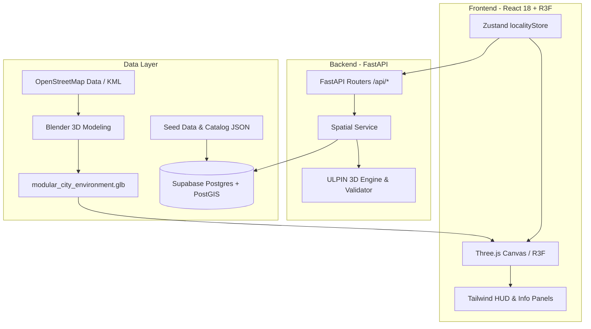

# 🇮🇳 Bharat Byte — 3D ULPIN System
### 3D Unique Land Parcel Identification & Vertical Property Mapping
**Smart India Hackathon (SIH) | Problem Statement: SIH26011**

[](https://react.dev/)
[](https://threejs.org/)
[](https://fastapi.tiangolo.com/)
[](https://supabase.com/)
[](https://shapely.readthedocs.io/)
[](https://tailwindcss.com/)
[](LICENSE)

---

## 📌 Executive Summary

India's **Bhu-Aadhaar (Unique Land Parcel Identification Number — ULPIN)** provides a 14-character alphanumeric identifier for land parcels based on their 2D geographic coordinates. While this works effectively for flat, open land, modern urban centers have expanded vertically:
- Multi-storey residential apartments and gated communities housing hundreds of families on a single parcel.
- High-rise commercial complexes with multiple distinct business tenancies.
- Multi-tiered underground infrastructure, including storm water drainage, utility tunnels, and multi-level underground metro stations.

In standard 2D land systems, an entire 20-storey tower shares only one single surface ULPIN. This creates critical challenges for:
1. **Property Ownership & Titles**: Inability to issue clear, tamper-evident digital cadastral records for individual flats or shops.
2. **Taxation & Cadastre**: Ambiguity in assessing floor-level and unit-level municipal property taxes.
3. **Sub-Surface Infrastructure Management**: Overlapping rights and spatial conflicts between underground utilities (metro tunnels, pipelines) and surface developments.
4. **Dispute Resolution & Collateralization**: Legal disputes over vertical rights, cantilevers, and mortgage identification.

**Bharat Byte** solves this by extending the national ULPIN system into a **deterministic, hierarchical 3D Cadastral Digital Twin**. It provides sub-metre spatial registration from the ground parcel down to individual floors, units, and underground utility tunnels.

---

## 🧬 ULPIN 3D Hierarchical ID Schema

The system enforces a standardized hierarchical schema that maintains full backward compatibility with India's 14-character Base ULPIN while embedding the full vertical ancestry:

```
BASE-ULPIN(14 chars) + "-B{2-digit building code}" + "-F{3-digit floor code | F-U{n} underground}" + "-U{3-digit unit code}"
```

```
Parcel (BASE-ULPIN: 14 chars)
 └── Building (-B{xx})
      └── Floor (-F{xxx} or -F-U{n})
           └── Unit (-U{xxx})
```

### Schema Breakdown

| Segment | Format | Example | Description |
|---|---|---|---|
| **Base ULPIN** | 14 chars | `29KA0512034521` | Standard Bhu-Aadhaar surface parcel ID (State + District + Coord Hash) |
| **Building** | `-B{2-digit}` | `-B01` | Specific building structure situated on that parcel |
| **Floor (Above Ground)** | `-F{3-digit}` | `-F003` | Floor number (e.g., `003` = 3rd Floor, `001` = Ground Floor) |
| **Floor (Underground)** | `-F-U{n}` | `-F-U1` | Sub-surface level (e.g., Basement 1, drainage layer, metro level) |
| **Unit** | `-U{3-digit}` | `-U002` | Individual apartment, flat, commercial office, or shop |

### Complete ID Example
```
29KA0512034521-B01-F003-U002
├── 29KA0512034521  -> Surface Parcel (Karnataka, District 05)
├── B01             -> Building 01 on the parcel
├── F003            -> 3rd Floor of Building 01
└── U002            -> Flat/Unit 02 on the 3rd Floor
```

### Underground Infrastructure ID Example
```
29KA0512034521-B01-F-U1-U001
└── Sub-surface level 1 infrastructure unit (Metro concourse / stormwater conduit)
```

> **Single Source of Truth:** Formally defined in [`shared/ULPIN_SCHEMA.md`](shared/ULPIN_SCHEMA.md).

---

## 🔬 Core Mathematical & Algorithmic Engines

The core engine ([`backend/app/services/ulpin_engine.py`](backend/app/services/ulpin_engine.py)) operates with zero external network or database dependencies, ensuring deterministic execution across seed pipelines, REST APIs, and automated test suites.

### 1. Deterministic Base ULPIN Generation
Generates a stable 14-character alphanumeric identifier from raw geographic coordinates:
- Latitude and Longitude are canonicalized to 7 decimal places (~centimetre precision): `f"{latitude:.7f}|{longitude:.7f}"`.
- A SHA-256 digest is calculated over the canonical coordinate string.
- The leading 8 bytes of the digest are converted to Base-36 (`0-9`, `A-Z`), modulo $36^{10}$, and zero-padded to 10 characters.
- Prepend 2-character State code (e.g. `29` for Karnataka) and 2-character District code (e.g. `KA`), forming a collision-resistant 14-character identifier.

### 2. 3D Morton Codes (Z-Order Space-Filling Curve)
For true 3D spatial hashing and voxel registration:
- Quantizes $(x, y, z)$ Cartesian offsets into 10-bit integers at decimetre resolution.
- Bit-interleaves the coordinates using space-filling curves:
  $$\text{Morton} = \text{spread}(z) \ll 2 \mid \text{spread}(y) \ll 1 \mid \text{spread}(x)$$
- Generates an 8-character hexadecimal code ensuring that spatially adjacent 3D units remain near each other in database indexes.

### 3. AI Spatial Verification Hash
A tamper-evident 4-character checksum generated via:
$$\text{Checksum} = \text{SHA256}(\text{BaseULPIN} : \text{Building} : \text{Floor} : \text{Unit} : \text{Volume}_{m^3} : \text{MortonCode})[:4]$$
This guarantees that unit dimensions, vertical position, or volume cannot be fraudulently altered without invalidating the cadastral record.

### 4. Topological & Geometric Validation (Shapely)
Validates spatial boundaries using exact polygon mathematics:
- **Unit Containment**: Verifies that unit footprint polygons are strictly contained within their parent floor boundary ($\text{Unit} \subseteq \text{Floor}$).
- **Non-Overlapping Units**: Computes intersection areas between adjacent units on the same floor; flags overlapping boundaries ($\text{Area}(U_i \cap U_j) > \epsilon$).
- **Vertical Cantilever Plausibility**: Validates that upper floors do not implausibly expand beyond the lower floor footprint beyond legal cantilever thresholds (maximum growth ratio $\le 1.20$).

---

## 🏙️ 3D Digital Twin & Locality Viewer

The frontend delivers an interactive 3D WebGL experience built with **React Three Fiber**, **Three.js**, and **Tailwind CSS**:

```
                                  [ 3D Cadastral Digital Twin ]
                                                │
         ┌──────────────────────────────┬───────┴──────────────────────┬──────────────────────────────┐
         ▼                              ▼                              ▼                              ▼
  [ Locality Layer ]           [ Building Stack ]            [ Underground Layer ]           [ Inspection HUD ]
  - Bengaluru RR Nagar         - Floor-by-floor explosion    - Storm water drains            - ULPIN hierarchy tree
  - OpenStreetMap meshes       - Unit boundary highlights    - Metro tunnel segments         - Ownership & property tax
  - Procedural road network    - Cantilever verification     - Underground stations          - Morton & spatial hashes
  - Indian street props        - Hover & click raycasting    - Depth-level toggles           - Instant fly-to camera
```

### Key Visualization Features:
- **Realistic Indian Urban Context**:
  - Procedurally generated Indian architectural features: flat parapet roofs, overhead Sintex water tanks, stairwell headrooms, terracotta sloped tiles, exterior balconies, and reinforced concrete pillars.
  - Authentic street furniture: neem and champa street trees, streetlamps, distribution transformers, and compound walls.
- **Underground Infrastructure Visualizer**:
  - Sub-surface raycasting and transparent terrain rendering.
  - Visualizes underground stormwater drainage conduits and Bengaluru Metro Green/Purple line tunnel segments with underground stations.
- **Hierarchical Drill-Down**:
  - **Level 1 (Locality)**: Explore 1,500+ buildings across Bengaluru's Rajarajeshwari Nagar (RR Nagar) synthetic locality.
  - **Level 2 (Building)**: Click any structure to focus camera, view story count, construction status, and floor breakdown.
  - **Level 3 (Floor)**: Expand floors vertically to inspect interior unit boundaries.
  - **Level 4 (Unit)**: Click any flat to reveal full 3D ULPIN, owner details, carpet area, volume, and verification hash.
- **Cadastral Search & Layer HUD**:
  - Real-time search by full or partial ULPIN, building name, complex, or house number.
  - Toggles for Roads, Buildings, Underground Utilities, Satellite Terrain, Wireframe, and Labels.

---

## 🏗️ System Architecture



---

## 📂 Repository Layout

```
bharat-byte/
├── frontend/                     # React 18 + TypeScript + Vite + Three.js app
│   ├── public/
│   │   ├── city_buildings_catalog.json   # 1,500+ building spatial catalog
│   │   ├── favicon.svg
│   │   └── icons.svg
│   └── src/
│       ├── api/                 # Axios backend API client
│       ├── components/          # 3D and UI components
│       │   ├── Building3D.tsx           # Interactive 3D building rendering
│       │   ├── BuildingListPanel.tsx    # Filterable list of all locality buildings
│       │   ├── CameraController.tsx     # Smooth camera lerp & fly-to animations
│       │   ├── IndianArchitecture.tsx   # Procedural roofs, tanks, balconies, pillars
│       │   ├── IndianStreetProps.tsx    # Trees, transformers, streetlamps
│       │   ├── LayerToggles.tsx         # HUD layer visibility toggles
│       │   ├── Legend.tsx               # Color-coded cadastral status legend
│       │   ├── LocalityBuildings.tsx    # Batched 3D locality buildings
│       │   ├── RoadNetwork.tsx          # Procedural roads and street markings
│       │   ├── SatelliteTerrain.tsx     # Base terrain rendering
│       │   ├── SearchBar.tsx            # Cadastral autocomplete search
│       │   ├── UlpinInfoPanel.tsx       # Detailed property & ULPIN metadata inspector
│       │   ├── UndergroundLayer.tsx     # Subterranean metro & drainage infrastructure
│       │   └── Unit3D.tsx               # Interactive 3D unit meshes
│       ├── scenes/              # R3F scene definitions (LocalityScene.tsx)
│       ├── store/               # Zustand state stores (localityStore.ts)
│       └── types/               # TypeScript interfaces & ULPIN definitions
├── backend/                      # Python 3.11 + FastAPI application
│   ├── app/
│   │   ├── db/                  # Database session & seed utilities
│   │   ├── models/              # Database models
│   │   ├── routers/             # API endpoints (spatial.py)
│   │   ├── schemas/             # Pydantic request & response contracts
│   │   ├── services/
│   │   │   ├── spatial_service.py # Spatial query handling & catalog resolution
│   │   │   └── ulpin_engine.py    # Deterministic ULPIN math & topology validator
│   │   └── main.py              # FastAPI entry point & CORS configuration
│   ├── tests/                   # Pytest test suite (test_ulpin_engine.py)
│   ├── city_buildings_catalog.json # Backend building catalog cache
│   ├── city_model_plans.json    # Building plan configurations
│   └── requirements.txt         # Backend Python dependencies
├── scripts/                      # Data pipeline scripts
│   └── convert_osm_to_kml.py    # OpenStreetMap to KML conversion utility
├── seed-data/                    # Locality geographic datasets
│   └── bengaluru_rr_nagar.kml   # Bengaluru Rajarajeshwari Nagar KML footprint
├── shared/                       # Cross-cutting specification documents
│   └── ULPIN_SCHEMA.md          # Single source of truth for 3D ULPIN schema
├── .gitignore                    # Ignore rules (excludes proprietary *.blend & *.glb)
└── README.md                     # System documentation (this file)
```

---

## 🚀 Quick Start Guide

### Prerequisites
- **Node.js**: v18.0 or higher
- **npm**: v9.0 or higher
- **Python**: v3.11 or higher
- **Git**

---

### 1. Backend Setup (FastAPI)

```bash
# Navigate to backend directory
cd backend

# Create and activate virtual environment
# Windows (PowerShell):
python -m venv .venv
.venv\Scripts\Activate.ps1

# Windows (Git Bash) / Linux / macOS:
# python -m venv .venv
# source .venv/bin/activate

# Install dependencies
pip install -r requirements.txt

# Configure environment variables
cp .env.example .env

# Start FastAPI development server
uvicorn app.main:app --reload --host 127.0.0.1 --port 8000
```

Verify backend health:
```bash
curl http://127.0.0.1:8000/health
# Response: {"status":"ok"}
```

Interactive OpenAPI Swagger documentation is available at: **http://127.0.0.1:8000/docs**

---

### 2. Frontend Setup (React + Vite)

In a new terminal:

```bash
# Navigate to frontend directory
cd frontend

# Install Node modules
npm install

# Start Vite development server
npm run dev
```

Open your browser at **http://localhost:5173** to launch the 3D Locality Viewer.

---

## 📡 REST API Reference

| Method | Endpoint | Description |
|---|---|---|
| `GET` | `/health` | API liveness and health check |
| `GET` | `/api/parcels` | List all registered surface land parcels with base ULPINs |
| `GET` | `/api/buildings` | Query buildings within locality (supports `limit=1500`) |
| `GET` | `/api/buildings/{id}` | Fetch specific building details, story count, and coordinates |
| `GET` | `/api/buildings/{id}/floors` | Fetch vertical floor stack for a building |
| `GET` | `/api/floors/{id}/units` | Fetch all individual units/flats on a given floor |
| `GET` | `/api/units/{id}` | Detailed unit record (assembled ULPIN, owner, area, volume, hash) |
| `GET` | `/api/underground` | List subterranean infrastructure (drainage lines, metro tunnels & stations) |
| `GET` | `/api/search?ulpin={query}` | Search by full/partial ULPIN, house number, or building name |
| `GET` | `/api/buildings/lookup?x={x}&y={y}` | Reverse-lookup building at 2D/3D ground coordinates |

---

## 🧪 Automated Testing

The spatial engine includes automated unit tests covering deterministic ULPIN generation, collision safety, hierarchical assembly, and boundary containment:

```bash
cd backend
pytest tests/test_ulpin_engine.py -v
```

### Test Cases Verified:
- `test_base_ulpin_generation_is_deterministic`: Verifies identical coordinate inputs produce identical 14-char ULPINs.
- `test_different_coordinates_produce_different_base_ulpins`: Verifies spatial entropy and sensitivity to minor coordinate changes.
- `test_assemble_normal_underground_and_parcel_only_ulpins`: Confirms proper formatting of surface, floor, and underground identifiers.
- `test_floor_topology_flags_overlapping_unit_footprints`: Validates that Shapely flags overlapping interior unit boundaries.
- `test_floor_topology_flags_unit_outside_floor_boundary`: Validates rejection of units projecting outside parent floor boundaries.
- `test_building_stack_flags_an_implausibly_larger_upper_floor`: Validates rejection of excessive cantilever/growth expansions.

---

## 🛠️ Cadastral & Geospatial Data Pipeline

```
OpenStreetMap (.osm)
       │
       ▼ (scripts/convert_osm_to_kml.py)
Google Earth KML (seed-data/bengaluru_rr_nagar.kml)
       │
       ▼ (Spatial Parsing & ULPIN Engine)
Locality Cadastral Database (city_buildings_catalog.json)
       │
       ▼ (Three.js Extrusions & Procedural Architecture)
Interactive 3D Cadastral Digital Twin
```

To convert raw OpenStreetMap extracts into KML parcel boundaries:
```bash
python scripts/convert_osm_to_kml.py input.osm seed-data/bengaluru_rr_nagar.kml
```

---

## 👥 Smart India Hackathon (SIH 2026)

- **Problem Statement ID**: SIH26011
- **Domain**: Smart Cities, Land Records & Geospatial Information Systems
- **Team**: Bharat Byte
- **Repository**: [https://github.com/kzllsmechbro-star/bharat-byte](https://github.com/kzllsmechbro-star/bharat-byte)

---

## 📄 License

This project is licensed under the MIT License — see the [LICENSE](LICENSE) file for details.
